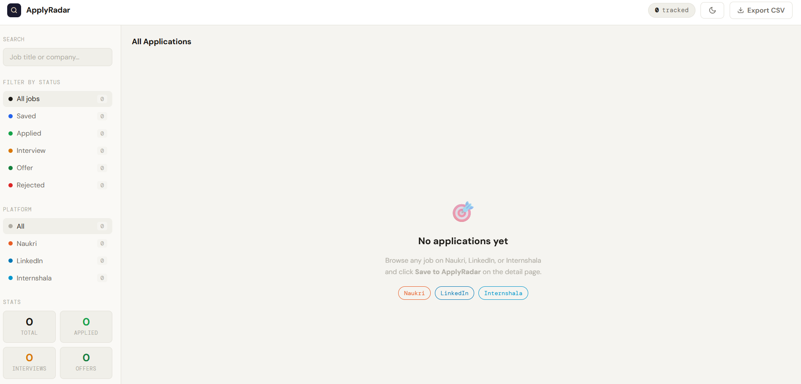
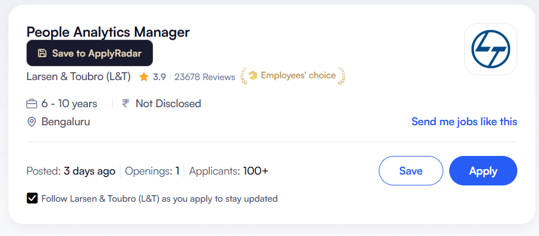
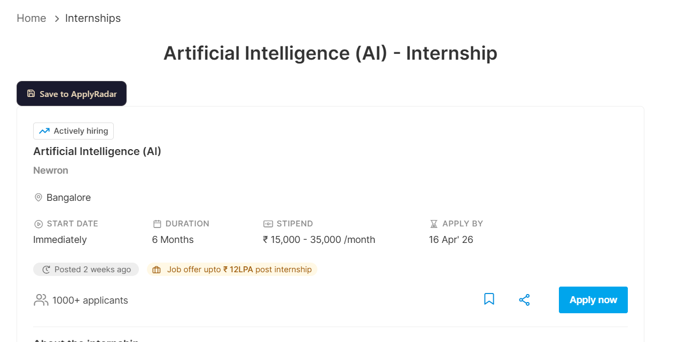
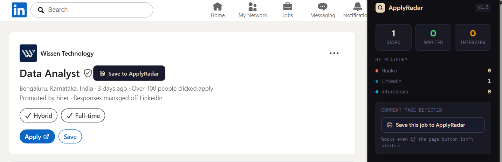

# ApplyRadar 🎯

> Track every job application across Naukri, LinkedIn, and Internshala — all in one place.

A Chrome extension for Indian job seekers. Save listings with one click, track them on a Kanban board, score your resume against job descriptions, and store multiple resume versions.



---

## ✨ Features

| Feature | Description |
|---|---|
| One-click save | Button injected on Naukri, LinkedIn, and Internshala detail pages |
| Popup save | Save from the extension icon even if the page button isn't visible |
| Kanban board | Drag cards between Saved → Applied → Interview → Offer → Rejected |
| Follow-up reminders | Set a date on any application — get a browser notification |
| ATS Resume Scorer | Paste JD + resume → instant keyword match percentage |
| Resume storage | Store multiple resume versions, auto-populate the ATS scorer |
| Resume templates | Curated ATS-friendly templates for Indian job seekers |
| Duplicate detection | Flags the same role saved from multiple platforms |
| Already-saved state | Button turns green on pages you've already tracked |
| Light & dark mode | Toggle in the dashboard, preference saved |
| CSV export | Download all applications as a spreadsheet |

---

## 📸 Screenshots

### Dashboard — Kanban + light mode


### Save button on Naukri


### Save button on Internshala


### Extension popup with quick save


---

## 🚀 Installation

**No build step required.** Load directly into Chrome.

**Option A — Download release zip (recommended)**

[⬇ Download latest release](https://github.com/nikhil-thomas-a/apply-radar/releases/latest) → unzip → follow steps 2–5 below.

**Option B — Clone or download manually**

1. Clone or download this repo
2. Go to `chrome://extensions`
3. Enable **Developer mode** (top-right toggle)
4. Click **Load unpacked** → select the `applyradar-v2` folder
5. Click the puzzle icon 🧩 in Chrome toolbar → pin ApplyRadar
6. In `chrome://extensions` → click **Details** on ApplyRadar → turn on site access for all 3 sites

---

## 📖 How to Save a Job

The **Save to ApplyRadar** button only appears on **detail pages** — not the listing/search feed.

### Naukri

1. Search for jobs → click any listing (details open on the right panel)
2. **Click the job title** to open it as a full page
3. URL changes to `naukri.com/job-listings-...` or similar
4. **Save to ApplyRadar** button appears below the title

> Shortcut: right-click any listing → **Open in new tab**

### LinkedIn

1. Search for jobs → click any listing in the left panel
2. **Click the job title** (it's a link) to open the full detail page
3. URL must contain `/jobs/view/` followed by a number — e.g. `linkedin.com/jobs/view/4361498042`
4. **Save to ApplyRadar** appears next to the Easy Apply button

> If the button doesn't appear: click the **ApplyRadar icon** in your toolbar → click **Save this job** in the popup

### Internshala

1. Click any listing → opens the detail page with URL `internshala.com/internship/detail/...`
2. **Save to ApplyRadar** appears at the top of the page

---

## 🗂 How to Use Each Feature

### Kanban board
Drag any card to a different column, or click a card to open the detail drawer and change status from the dropdown.

### Follow-up reminders
Click any card → set a **Follow-up Date** → Save. You'll get a Chrome notification on that date reminding you to follow up. Works even when the browser is closed (Chrome handles background alarms).

### ATS Scorer
Go to the **ATS Scorer** tab → paste the job description → paste your resume text (or select a saved resume) → click **Score**. You'll see:
- A match percentage
- Keywords your resume already contains ✓
- Keywords missing from your resume ✗

### My Resumes
Go to the **My Resumes** tab → click **+ New Resume** → paste your resume text → save. Create multiple versions for different roles (e.g. "Product Manager — Startups", "PM — Enterprise"). The ATS Scorer will let you pick which version to compare.

### Resume Templates
The **Templates** tab has 6 curated ATS-friendly templates. All are single-column or clean two-column — no tables, no text boxes. These parse correctly on Naukri, LinkedIn, and company career portals.

---

## 📁 Project Structure

```
applyradar-v2/
├── manifest.json          # Chrome extension config (Manifest V3)
├── background.js          # Service worker: storage, duplicate detection, alarms
├── content/
│   ├── shared.js          # Injected save button (light mode, already-saved check)
│   ├── naukri.js          # Naukri detector and extractor
│   ├── linkedin.js        # LinkedIn detector and extractor
│   └── internshala.js     # Internshala detector and extractor
├── popup/
│   ├── popup.html         # Toolbar popup UI
│   └── popup.js           # Stats, quick-save via scripting.executeScript
├── dashboard/
│   ├── index.html         # Full dashboard with tabs
│   └── dashboard.js       # Kanban, ATS scorer, resume storage, templates
└── icons/
```

---

## ⚠️ Known Limitations

| Limitation | Reason |
|---|---|
| Detail pages only | The extension needs a single job — listing feeds show 20+ simultaneously |
| LinkedIn requires `/jobs/view/` URL | Only the full detail page has the complete job card |
| Chrome only | Manifest V3 with `scripting` API — Firefox needs a separate build |
| Selectors may break | LinkedIn/Naukri update their DOM occasionally — open an issue with the HTML if something breaks |

---

## 🗺 Roadmap

- [ ] Cloud sync (Supabase) — access your tracker from any device
- [ ] Email reminders — weekly digest of pending applications
- [ ] Firefox support
- [ ] AI-powered resume suggestions (Pro tier)

---

## 🤝 Contributing

Open source under MIT. If a platform updates their DOM and a selector breaks, open an issue with:
1. The platform (Naukri/LinkedIn/Internshala)
2. The page URL (just the path, no need for the full URL with tracking params)
3. The HTML of the element containing the job title

Fixes are usually a one-liner.

---

## 📄 License

MIT — free to use, modify, and distribute.
